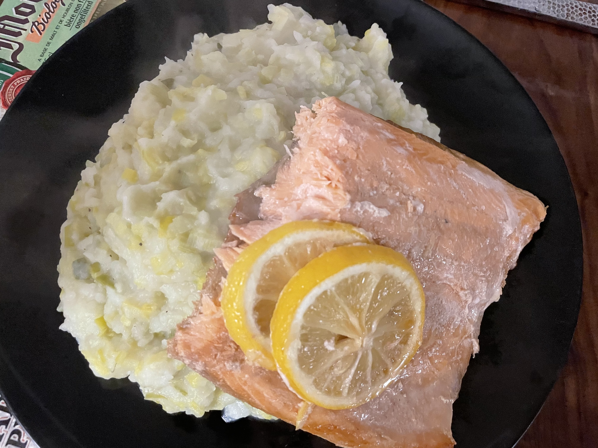

# Prei stamppot met zalm 
## Leek stamppot with oven roasted salmon fillet
_fish_, _dutch_, _stamppot_, _nederlandse keuken_, _28-dagen-stamppot_
Preparation time: 35 mins  
2-3 portions  

  

## Ingredients
* 1kg soft-cooking potatoes, russet works fine)
* 2 aubergines (approx. 450g)
* 1 big red onion)
* 3 tbsp. extra virgin olive oil
* 350g button mushrooms / champignons (quartered) 
* tomato paste (140g can)
* 100g of ripened sheep cheese (shredded)
* coarse salt 

## Preparation
* Cut aubergines lengthwise into 4 parts of approximately equal thickness. Lightly brush them with olive oil, lay them out on a siblge layer on a cookie sheet and sprinkle with coarse salt (about 2 tsp). Bake (from cold) in the oven at 180°C for 45 minutes until lightly charred and browning. They should be very aromatic and loose about 20% water mass, your kitchen is goign to smell great.
* Meanwhile, peel and cut potatoes into ~4-5cm cubes and place in a large pot. Fill up with cold tap water until the potatoes are completely submerged. Bring to a rolling boil and cook until the potatoes are soft enough than a fork easily passes through (about 15-20 minutes).
* While the potatoe are boiling, slice the red onion(can be rings, or slivers) and fry with remaining olive oil in a deep pan. Once the onion softens, add the quartered mushrooms and continue to pan fry at medium / medium high heat.
* Once the mushrooms and onions reach a soft and lightly seared consistency, add the tomato paste directly to the pan and toss with a spatula. Turn off the heat once the vegetables are fully coated in tomato pate. 
* Remove the aubergines from the oven and allow to cool; once cold enough to handle, cut roasted aubergine into 2-3cm chunks. Drain the potatoes and let residual moisture evaporate for 2 minutes. Combine aubergie and potatoes and mash together until a homogenous but not smooth consistency is achieved with a masher. Fold in onion, mushroom, tomato portion from the pan.
* Serve immediately with a handful of coursely grated sheep cheese on top.

### Eet Smakelijk!

recipe inspired by / adapted from [Albert Heijn NL](https://www.ah.nl/allerhande/recept/R-R719756/italiaanse-stamppot-met-aubergine)

