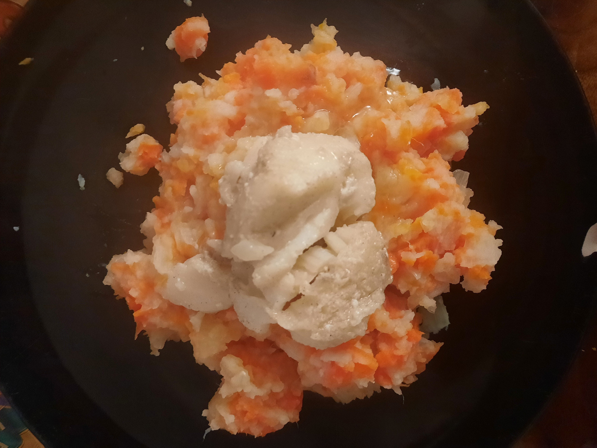

# Hutspot met kabeljauwfilet 
## Hutspot (mashed potatoes and carrots) with cod fillet
_fish_, _Dutch_, _stamppot_, _vis_, _Nederlandse keuken_, _28-dagen-stamppot_  
Preparation time: 45 mins  
2-3 portions  

  

## Ingredients
* 1kg soft-cooking potatoes (russet works fine)
* 800 g carrots
* 1 big yellow onion
* some milk
* 60 g butter
* 2 or 3 cod fillets
* white pepper and salt 

## Preparation
* Peel potatoes, cut carrots in 1 cm pieces, and finely cut the onion.
* Boil potatoes, carrots and onion in a big pot for 20 minutes until potatoes are soft.
* Heat the butter in a frying pan. Add cod fillets and heat in butter until they fall apart, approx. 30-40 minutes. Add salt and white pepper to taste. 
* At the same time, heat some milk (approx. 100 mL) in a small pot.
* drain the potato/carrot/onions mixture. Mash with the heated milk. Add salt and white pepper to taste. 

### Eet Smakelijk!

back to the [28-dag-stamppot calendar](https://mlopatka.github.io/recipe-book/)
