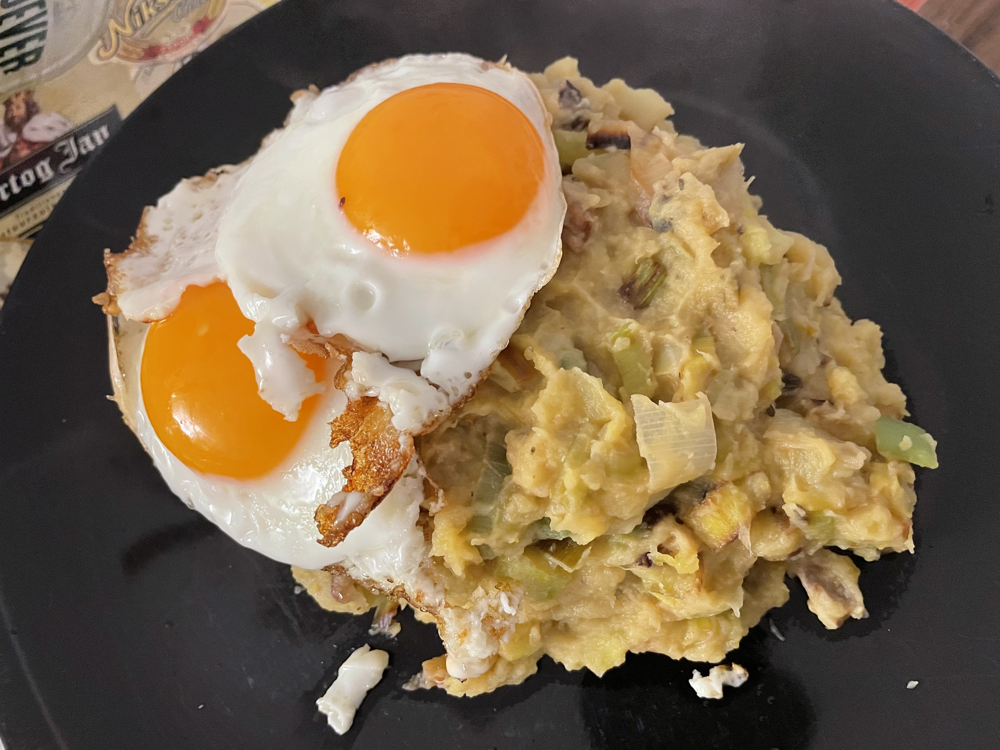

# Pompoenstamppot met prei
## potato pumpkin stamppot with leek and eggs
_vegetarian_, _dutch_, _stamppot_, _vegetarische_, _nederlandse keuken_, _28-dagen-stamppot_  
Preparation time: 45 mins  
4 portions  

  

## Ingredients
* 500g soft-cooking potatoes, russet works fine
* 700g pumpkin or squash (blue hubbard squash is my favourite)
* 3 large leeks (approx. 400-500g)
* 70g butter
* 100ml milk
* 4 large eggs
* 1 medium apple
* 150g soft unripened goat cheese
* 100g crushed walnut pieces
* salt and pepper

## Preparation
* Peel and cut potatoes into ~4-5cm cubes and place in a large pot. Fill up with cold tap water until the potatoes are completely submerged. 
* Peel and cut squash or pumpkin into similar sized pieces as potatoes and add to pot.
* Peel, core, and quarter apple and add to pot.
* Bring potatoes, squash, and apples to a rolling boil and cook until the potatoes are soft enough than a fork easily passes through (about 15-20 minutes).
* While the potatoes are boiling, slice the leeks lengthwise and clean out green ends. Then chop into rings and place in a deep frying pan. Fry the leeks wi butter adding the walnuts in just as they are becoming soft and rings are falling apart. 
* Pan fry 1-2 eggs on olive oil, per person sunny-side up.
* Drain the potatoes and let residual moisture evaporate for 2 minutes. Combine fried leeks, walnut, goat cheese, milk, and mash together until a homogenous but not smooth consistency is achieved with a masher. 
* Serve immediately with stamppot layer and eggs on top.

### Eet Smakelijk!
