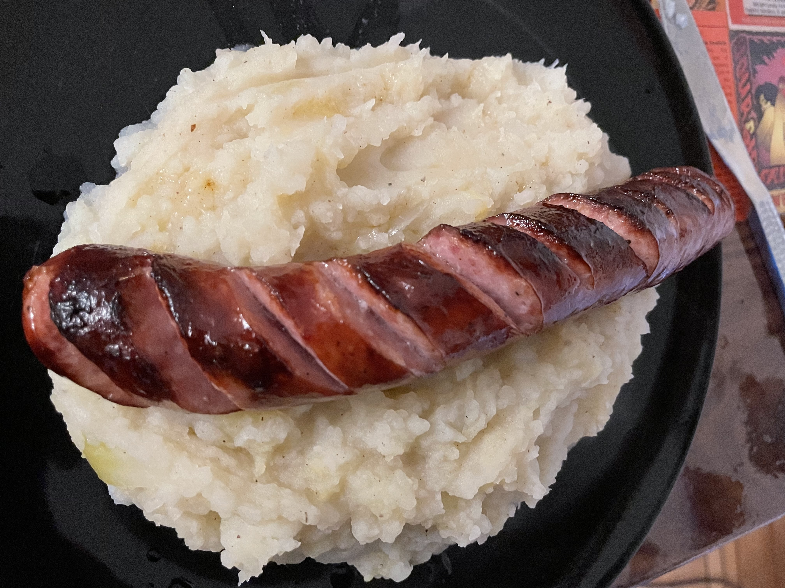

# Hete bliksem 
## Stamppot with potatoes and apples
_Dutch_, _stamppot_, _Nederlandse keuken_, _28-dagen-stamppot_  
Preparation time: 30 mins  
2-3 portions  

  

## Ingredients
* 800 g soft-cooking potatoes (russet works fine)
* 500 g apples (mix of sour and sweet apples)
* 1 big onion
* some butter, 
* dash of milk
* pepper and salt to taste
* pinch of cinnamon

## Preparation
* Peel and cut potatoes into ~4-5cm cubes, coarsely cut onion and apples. 
* Place potatoes and onion in a large pot, fill to cover potatoes to approx. 2/3 and bring to a rolling boil. 
* After 5 minutes, add the apples.
* Cook until the potatoes are soft enough than a fork easily passes through (about 15-20 minutes).
* Poor the water off. Add milk, butter, pepper, salt, and cinnamon and mash the mixture.
* Serve with a rookworst, or with fried bacon. 

### Eet Smakelijk!

source [Leuke Recepten NL](https://www.leukerecepten.nl/recepten/hete-bliksem/)

