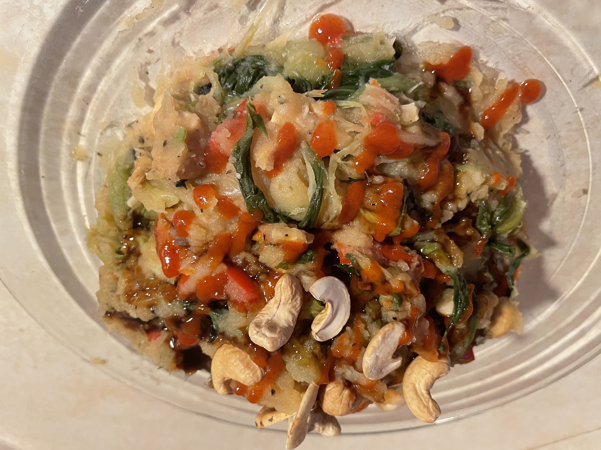

# Oosterse paksoi stamppot
## Eastern-style paksoi (Chinese cabbage) stamppot
_vegetarian_, _dutch_, _stamppot_, _vegetarische_, _nederlandse keuken_, _28-dagen-stamppot_  
Preparation time: 25-30 mins  
2-3 portions  

  

## Ingredients
* 800g peeled potatoes (russet work fine)
* 300-400g fresh paksoi / bokchoi (or other Chinese cabbage varietal)
* 200g whole or halved cashew nuts
* 2 large red capsicums
* 4 cloves of garlic
* 1 large onion
* 2 tbsp olive oil
* 3 tbsp ketjap manis
* salt and pepper

## Preparation
* Peel and cut potatoes into ~4-5cm cubes and place in a large pot. Fill up with cold tap water until they are completely submerged. 
* Bring potatoes to a rolling boil and cook until soft enough than a fork easily passes through (about 20 minutes).
* Dice onion and garlic.
* Chop paksoi cabbages into lengthwise quarters and separate layers while washing. 
* In a large wok or deep frying pan heat olive oil and add onions and garlic. Fry until onions start to soften then add chopped and washed paksoi into wok and stir to coat with oil. Continue cooking on medium heat agitating occasionally to ensure even cooking.
* Slice red capsicum peppers into strips and add to wok once packsoi leaves have wilted and stems are starting to soften.
* Once potatoes are done boiling, set asside a handful of cashews for the garnish and add the remaining cashews to the wok and turn heat down to low.
* Drain the potatoes and let residual moisture evaporate for 2 minutes. 
* Combine all the wok vegetables with the potatoes  while the  potatoes are still hot and mash together with ketjap manis, cashews, salt and pepper.
* Serve immediately with reserved cashews on top and additional ketjap manis and siracha hot sauce to flavour.

### Eet Smakelijk!

Recipe inspired by / adapted from [www.lekkerensimpel.com](https://www.lekkerensimpel.com/paksoi-stamppot/)