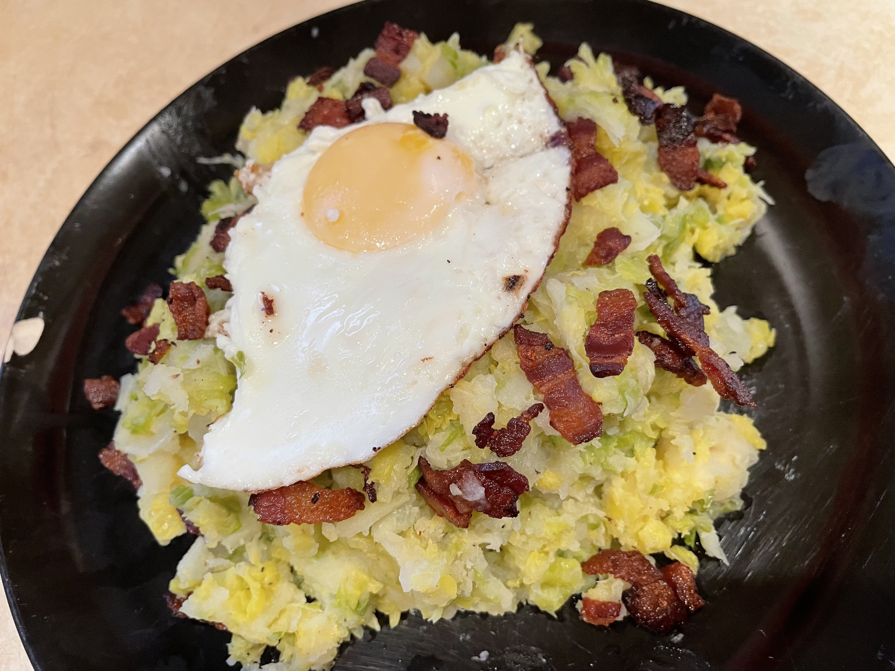

# Spruiten Stamppot
## Stamppot with Brussel Sprouts
_Dutch_, _stamppot_, _Nederlandse keuken_, _28-dagen-stamppot_  
Preparation time: 40 mins  
2-3 portions  

  

## Ingredients
* 1 kg soft-cooking potatoes (russet works fine)
* 800 g brussel sprouts
* 50 g butter
* 1 yellow onion
* pepper and salt 
* 2-3 eggs (one egg per intended serving portion)
* 150g of smoked bacon 

## Preparation
* Peel and cut potatoes. Place potatoes and chopped onion into a large pot, cover them 2/3 with water, and boil until the potatoes are soft, or approx. 20 minutes. 
* Trim the Brussel sprouts removing stem and any discoloured leaves. Place them In a separate pot with water up to just below the Brussel sprouts. Boil the Brussel sprouts only after the potatoes have been boiling for about 10 minutes so they are ready at approximately the same time.
* Cut smoked bacon into 0.5-1.0 cm squares and fry on medium/low heat until crispy.
* Pour off excess water from both the potatoes and Brussel sprouts and combine in the larger of the two pots. Combine with butter, salt and pepper, and add bacon drippings. Mash until a homogeneous blend is achieved at the texture of your preference. Brussel sprouts should be broken up and distributed among the potato substrate.
* Fry eggs sunny-side-up in the same pan as bacon was fried, using remaining bacon drippings to prevent sticking.
* Serve topped with a fried egg. 

### Eet Smakelijk! 

back to the [28-dag-stamppot calendar](https://mlopatka.github.io/recipe-book/)
