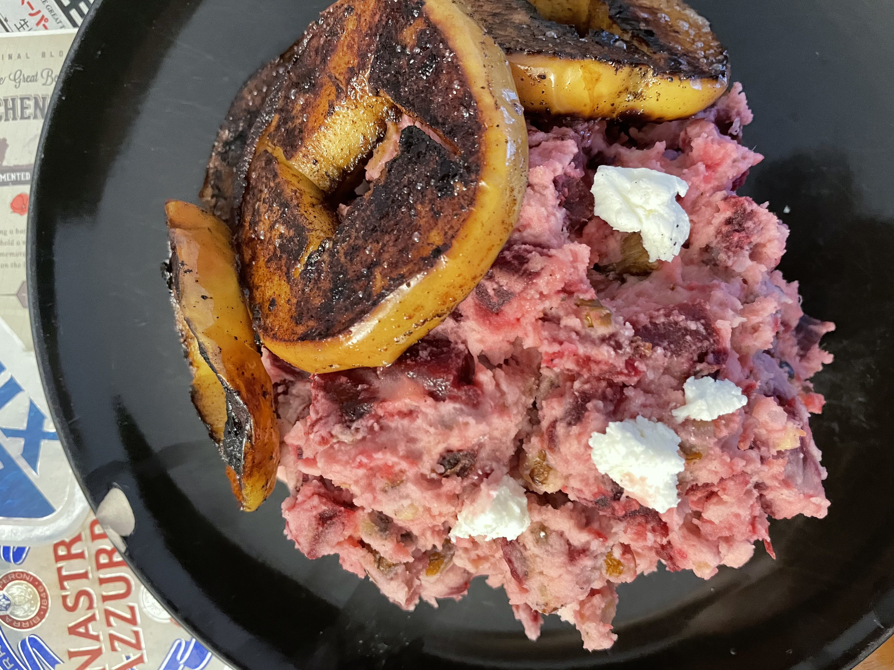

# Rood Bieten Stamppot met appel
## Red Beet Stamppot with fried apple rounds
_Dutch_, _stamppot_, _Nederlandse keuken_, _28-dagen-stamppot_, _vegetarian_, _vegetarische_  
Preparation time: 60 mins  
2-3 portions  

  

## Ingredients
* 800 g soft-cooking potatoes (russet works fine)
* 500 g red beets
* 80 g butter
* pepper and salt 
* 150 g soft unripened goat cheese
* 200 g of crushed walnuts
* 1 tsp cinnamon 
* 1 tbsp grapeseed oil
* 2 large apples (any kind will do, but you may want a slightly more tart varietal)

## Preparation
* Clean and trim red beets. Cut each in half and arrange on a griddle or cookie sheet covered in grapeseed oil. Salt the beets slightly, dont worry if most of the salt is just on the cookie sheet. Roast the beets in the oven at 375C for 45 minutes flipping once in the middle. 5 minutes before the cooking is finished, increase oven to broil (500C) and flip all beets to have the  skin facing upwards (cut side down). The outer skin should be blistered and charred black in some places. Set aside the beets to cool.
* While the beets are roasting, peel and cut potatoes. Place potatoes into a large pot, cover them 2/3 with water, and boil until the potatoes are soft, or approx. 20 minutes. 
* While the potatoes are cooking divide the butter into two portions, one for the stamppot mixture and one for frying the apple rounds.
* Core the apples (with a paring knife if you dont have a coring tool). Slice each apple into 4-5 equal width rings. heat butter in a pan and once it starts to sizzle add the apple rounds and dust lightly with cinnamon. Fry the apple rounds until they are brown and develop a nice char and soft all the way through.
* Pour off excess water from the potatoes and add half the butter, salt and pepper, walnuts, and goat cheese. Mash until a homogeneous blend is achieved.
* When cool enough to handle, peel off the burnt skin from the beets and dice the roasted beets. Combine the diced beets witht eh potato mixture. 
* Serve topped with the fried apple rounds.

### Eet Smakelijk! 
Recipe inspired by /adapted from: [leukerecepten.nl](https://www.leukerecepten.nl/recepten/bietenstamppot/)