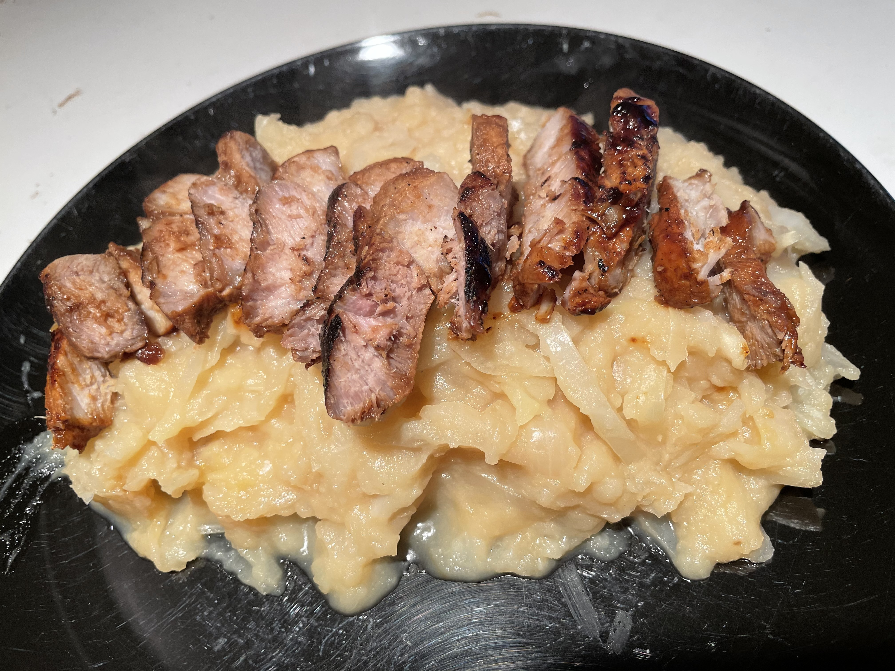

# Chinese Kool Stamppot met speklappjes
## Chinese Cabbage Stamppot with pork loin
_Dutch_, _stamppot_, _Nederlandse keuken_, _28-dagen-stamppot_, _pork_, _asian fussion_
Preparation time: 40 mins  
2-3 portions  

  

## Ingredients
* 1 kg soft-cooking potatoes (russet works fine)
* 0.5 of a large green chinese cabbage (approx. 500g) substitute for savoy cabbage if you want a sweeter flavour
* 300 g pork loin
* 2 tsp olive oil
* 100ml milk
* pepper and salt 
* 1 sweet white onion
* 2 tbsp ketjap manis 
* 1 tbsp brown sugar
* 1 tbsp coarse rock salt
* 1 tsp rice vinegar

## Preparation
* Peel and trim pumpkin and celeriac and chop into 2-3cm sized cubes. 
* Coarsely dice a large red onion (or 2 small/medium onions).
* Peel and cut potatoes. Slice into 2-3 cm chunks and place potatoes into a large pot, along with pumpkin and celeriac. Cover them 2/3 with water. Add the stock cube to the vegetables and boil until the potatoes are soft, or approx. 20 minutes. 
* Pour off excess fluid from the potato, celeriac, pumpkin mixture and add the butter, salt and pepper, and thym. Mash until a homogeneous blend is achieved.
* Fry 2 eggs per portion on olive oil.
* Serve hot with fried sunny-side eggs on top of stamppot mixture.

### Eet Smakelijk! 
Recipe inspired by / adapted from: [Lidl](https://recepten.lidl.nl/recept/chinese-koolstamppot-met-speklapjes)