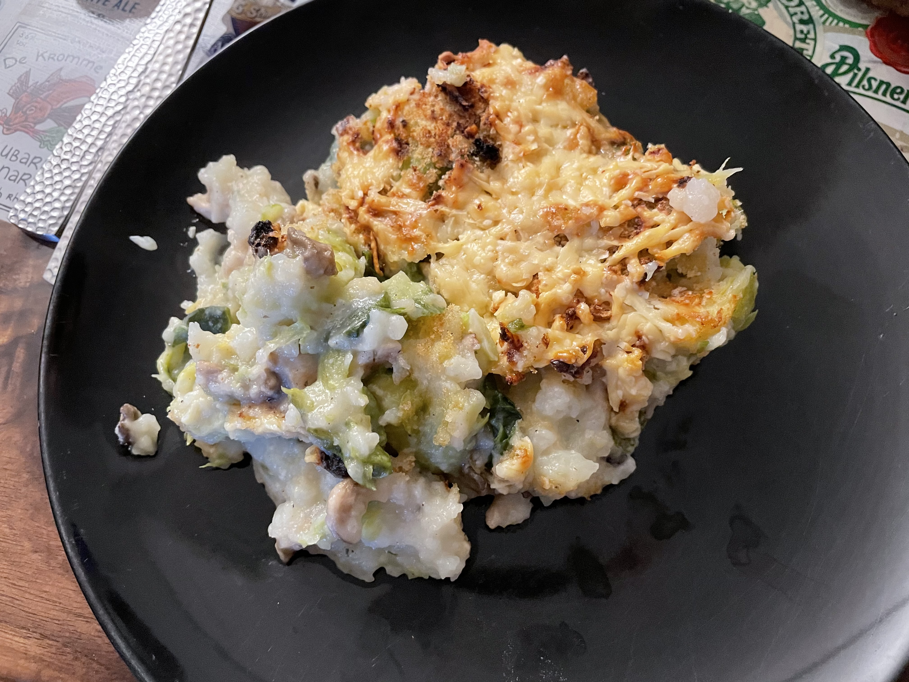

# Stamppot uit de oven met spruitjes, oesterzwammen en oude kaas
## Oven baked stamppot with spruits, oystermushrooms, and aged farmer's cheese
_Dutch_, _stamppot_, _Nederlandse keuken_, _28-dagen-stamppot_, _vegetarisch_  
Preparation time: 60 mins  
2-3 portions  

  

## Ingredients
* 1 kg soft-cooking potatoes (russet works fine)
* 500 g Brussels sprouts
* 200 g oyster mushrooms
* 40 g butter
* 300 mL milk
* 3 Dutch twice baked bread (beschuit)
* pepper and salt
* nutmeg 
* 200 g grated old Dutch cheese (boerenkaas)

## Preparation
* Peel and cut potatoes into 2-3 cm chunks and place into a large pot. Cover 2/3 of the way with water, and boil until the potatoes are soft, or approx. 20 minutes.
* In the meantime, boil the Brussels sprouts for 6-8 minutes until they're just done. Preheat the oven to 200 degrees Celsius.
* Cut the oyster mushrooms in slices, sprinkle some salt on them and fry them on a hot fire.
* Heat the milk together with the butter in a small pot.
* Poor of the water from the potatoes and mash them together with the milk, butter, pepper, salt, and addd some nutmeg to taste
* Place the mashed potatoes in a greased oven dish. Crumble the twice baked bread on top, and sprinkle the grated cheese on top.
* Bake for 15 minutes until golden brown. 

### Eet Smakelijk! 
Recipe inspired by / adapted from: [De Hippe Vegetarier](https://www.dehippevegetarier.nl/vegetarische-recepten/stamppot-oven-spruitjes-oesterzwammen-en-oude-kaas/)
