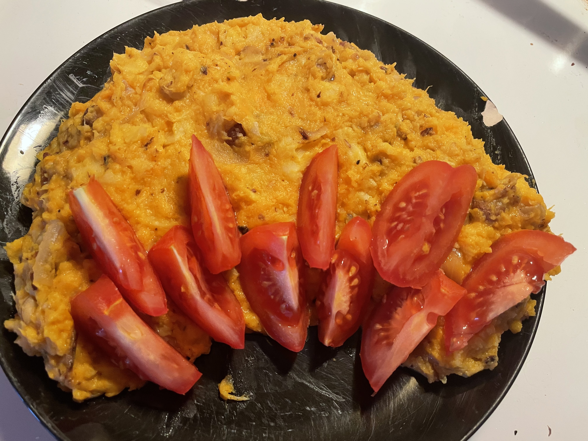

# Pastinaak Zoetaardappel Pompoen Stamppot met Hazelnooten
## Parsnip Pumpkin Yam stamppot with hazel nuts 
_Dutch_, _stamppot_, _Nederlandse keuken_, _28-dagen-stamppot_, _vegetarian_, _vegetarische_  
Preparation time: 30 mins  
3-4 portions  

  

## Ingredients
* 500 g pumpkin (or squash)
* 500 g parsnips
* 300 g sweet potato (orange yams)
* 50 g butter
* 1 large sweet white onion
* 4 cloves of garlic
* 150 g soft unripened goat cheese
* 150 g sour cream (or crème fraishe)
* 150 g whole hazelnuts
* 4 large ripe tomatoes
* 1 tsp thyme
* 1 tsp coarse salt

## Preparation
* Peel and clean yams, pumpkin, and parsnips and chop into approximately equal and uniform sized pieces (4-5cm) and place into a large pot. Cover 2/3 of the way with water, and boil until the sweet potatoes are soft (approx. 20 minutes). By the time the yams have softened everything else should also be soft enough that a fork passes through easily. 
* Chop the sweet onion into thin strips or rings and place in a frying pan along with chopped garlic and butter. Heat at medium temperature and add heat.
* Roughly crush the hazelnuts into different sized pieces. I do this by placing them in a paper bag and hitting it with a rolling pin, but you can just as easily use the broad side of a chef's knife or a mallet; whatever gets the job done. Add the hazelnuts to the pan with the onions, garlic, and butter and stir together while keeping heat.
* In a mortar and pestle, combine the thyme and coarse salt and blend together. Add this thyme/salt to the frying pan. 
* Pour off excess fluid from the pumpkin/yam/parsnip mixture and allow remaining moisture to evaporate for 2 minutes. Add the sour cream and goat cheese  and mash until well combined but still chunky, the aim is not a purée.
* Fold in the onion, garlic, and hazelnuts including all the liquid contents from the frying pan to the mixture and stir together.
* Serve hot stamppot topped with fresh tomato wedges on top.

### Eet Smakelijk! 

back to the [28-dag-stamppot calendar](https://mlopatka.github.io/recipe-book/)
