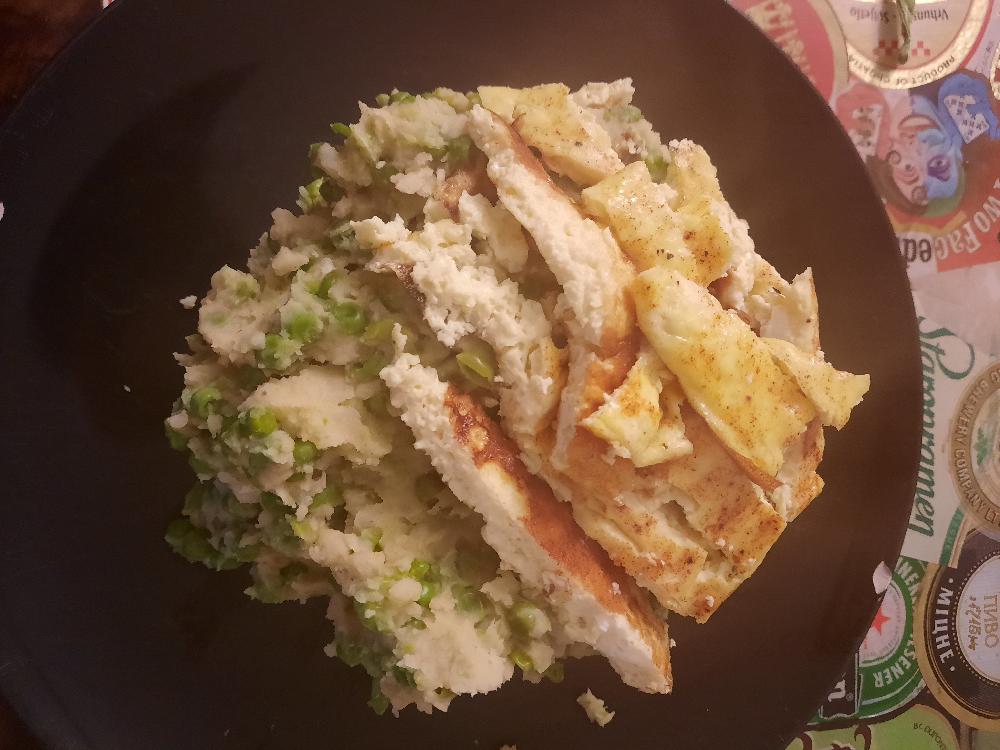

# Erwten stamppot met omelet 
## Green pea stamppot with fried egg topping
_Dutch_, _stamppot_, _Nederlandse keuken_, _28-dagen-stamppot_ , _vegetarian_ , _vegetarisch_
Preparation time: 35 mins  
3-4 portions  

  

## Ingredients
* 1 kg soft-cooking potatoes (russet works fine)
* 750 g frozen green peas 
* 5 eggs
* 200 g crème fraiche (or sour cream)
* 100-150 mL milk
* sambal
* salt and pepper

## Preparation
* Peel and cut potatoes into 2-3 cm chunks and place into a large pot. Cover 2/3 of the way with water, and boil until the potatoes are soft, or approx. 20 minutes.
* In the meantime, heat the frozen green peas in a pot covered with water for 6-8 minutes. 
* Mix the eggs in a bowl with the milk, salt, and pepper to taste. Fry the omlet in a pan. 
* Poor excess water of the potatoes and mash potatoes with the crème fraiche, salt, and pepper.
* Poor water of the peas and mix them with the potato mash. 
* Serve with sambal. 

### Eet Smakelijk!
Recipe inspired by: [Leuke Recepten NL](https://www.leukerecepten.nl/recepten/erwten-stamppot-pittige-hamblokjes/)
