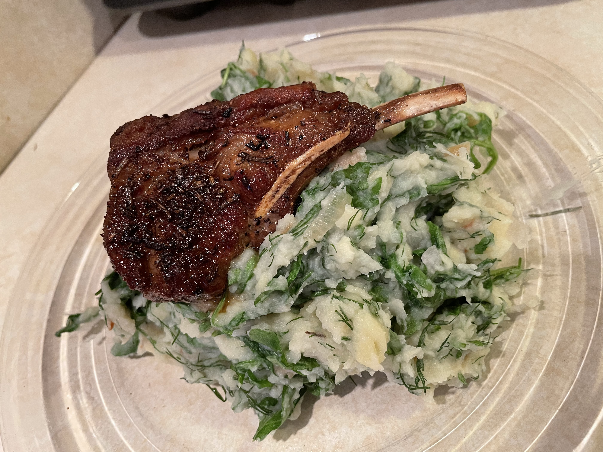

# Rucola Pastinaak Stamppot met Lamsvlees 
## Arugula and Parsnip Stamppot with Lamb
_Dutch_, _stamppot_, _Nederlandse keuken_, _28-dagen-stamppot_ , _lamb_  
Preparation time: 40 mins  
3-4 portions  

  

## Ingredients
* 800 g soft cooking potatoes (russet work fine)
* 600 g parsnips 
* 40 g butter
* 80 ml sour cream
* 3 large shallots
* 8 cloves of garlic
* 240g fresh arugula (washed)
* 2 tbsp fresh chopped dill
* 1 tbsp fresh chopped rosemary
* 4 tsp seasalt
* 50ml olive oil
* 3-4 blades of bone-in lamb rib 

## Preparation
* Peel and cut potatoes and parsnips into 2-3 cm chunks and place into a large pot. Cover 2/3 of the way with water, and boil until the potatoes are soft, or approx. 20 minutes.
* Dice the garlic and shallots and fry together with butter in a small frying pan on low heat until seared to a slight brown.
* Rinse the lamb meat and pat dry, toss meat in olive oil with 2 tsp of sea salt and all of the rosemary. Set aside until 10 minutes before intended serving time.
* Wash the arugula and dill. remove thick stems from dill and chop into 1cm long pieces.
* Heat a heavy metal pan on very high heat until it is searing hot. Pan fry the lamb including all the olive oil and rosemary tossing regularly to achieve a uniform sear on the outside while maintaining a pink rare to medium cooking level at the centre.
* Pour off the excess water form the potatoes and parsnips and quickly mash with the sour cream and remaining 2 tsp of salt. Add the fried shallots and garlic and continue mashing. Add the raw dill and arugula and mash further until the greens are evenly blended in and softened by the existing heat of the mixture.
* Serve in the centre of a large plate with the lamb piece nestled into the stamppot.

### Eet Smakelijk!

back to the [28-dag-stamppot calendar](https://mlopatka.github.io/recipe-book/)

