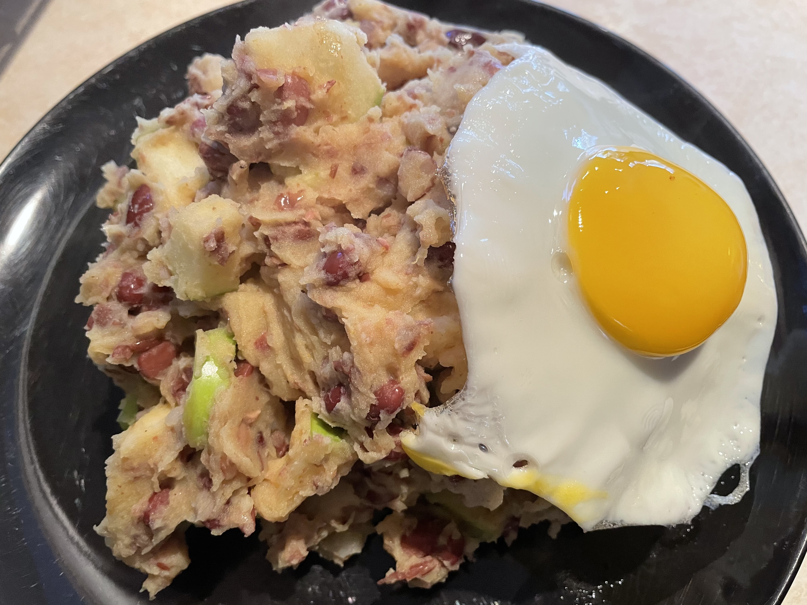

# Bruine bonen stamppot 
## Brown bean stamppot
_Dutch_, _stamppot_, _Nederlandse keuken_, _28-dagen-stamppot_ , _vegetarian_, _vegetarisch_  
Preparation time: 24 hours to soak beans + 60 mins  
3-4 portions  

  

## Ingredients
* 1 kg soft cooking potatoes (russet work fine)
* 400 g dried brown beans (small red kidney beans)
* 1 big sour apple or 2 smaller ones (e.g., granny smith)
* a dash of milk
* some butter
* salt, pepper, curry powder
* 4 eggs

## Preparation
* Soak the beans 24 hours in advance.
* Boil te brown beans for 45 - 60 minutes. Pour excess water off.
* Peel and cut potatoes into 2-3 cm chunks and place into a large pot. Coarsely dice the red onion and add to the pot with potatoes. Cover 2/3 of the way with water, and boil until the potatoes are soft, or approx. 20 minutes.
* Warm the milk and the butter in a small pot.
* Pour off the excess water form the potatoes and let evaporate excess moisture for 2 minutes. Mash with salt, pepper, curry powder, milk and butter until a smooth and homogeneous mixture is achieved.
* Add the brown beans to the mash and mash them in.
* Cut the apple in small pieces and stir through the stamppot. 
* Serve with a fried egg. 

### Eet Smakelijk!
recipe source [Koken met Koos](http://www.kokenmetkoos.nl/stamppotten/bruine-bonen-stamppot/)

