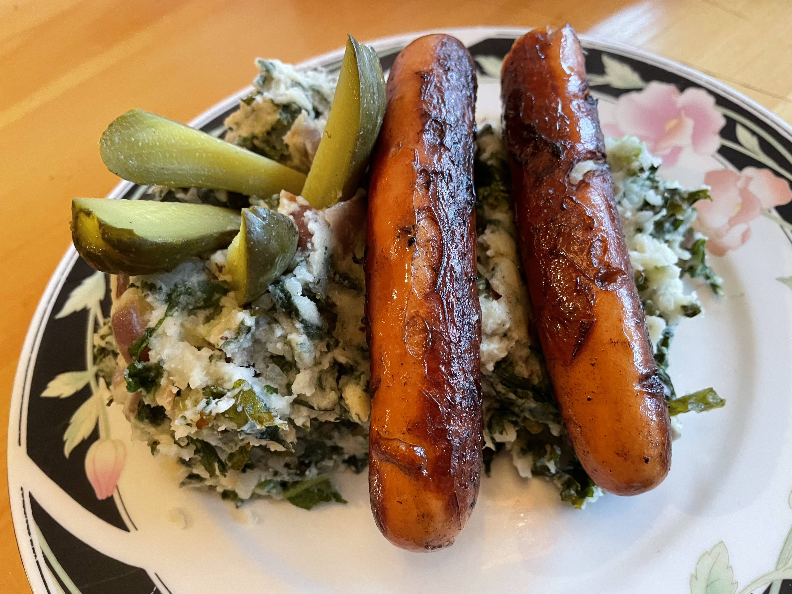

# Boerenkool stamppot 
## Kale potatoe stamppot
_Dutch_, _stamppot_, _Nederlandse keuken_, _28-dagen-stamppot_
Preparation time: 40 mins  
4 portions  

  

## Ingredients
* 1.4 kg soft cooking potatoes (russet work fine)
* 300 g fresh kale
* 300 g fresh spinach
* 1 big red onion
* 4 small shallots
* 4 cloves of garlic
* a dash of milk
* 40g butter
* salt and pepper
* 4 smoked pork sausage links (or farmer's sausage)
* dill pickles

## Preparation
* Peel and cut potatoes into 2-3 cm chunks and place into a large pot. Cover 2/3 of the way with water, and boil until the potatoes are soft, or approx. 20 minutes.
* Coarsely dice the red onion, shallots, and garlic. Add with butter to a deep frying pan and heat until garlic starts to brown. 
* Finely chop the kale and spinach. Once the garlic is browing add the spinach and kale to the pan and toss until coated in butter. Keep on low heat, tossing occasionally until potatoes are finished boiling.
* Score the sausages along one side and fry in a separate pan. 
* Warm the milk in a small pot.
* Pour off the excess water form the potatoes and let evaporate excess moisture for 2 minutes. Mash with salt, pepper, and warm milk. 
* Serve with sausage on top and dill pickle spears.

### Eet Smakelijk!  

back to the [28-dag-stamppot calendar](https://mlopatka.github.io/recipe-book/)
