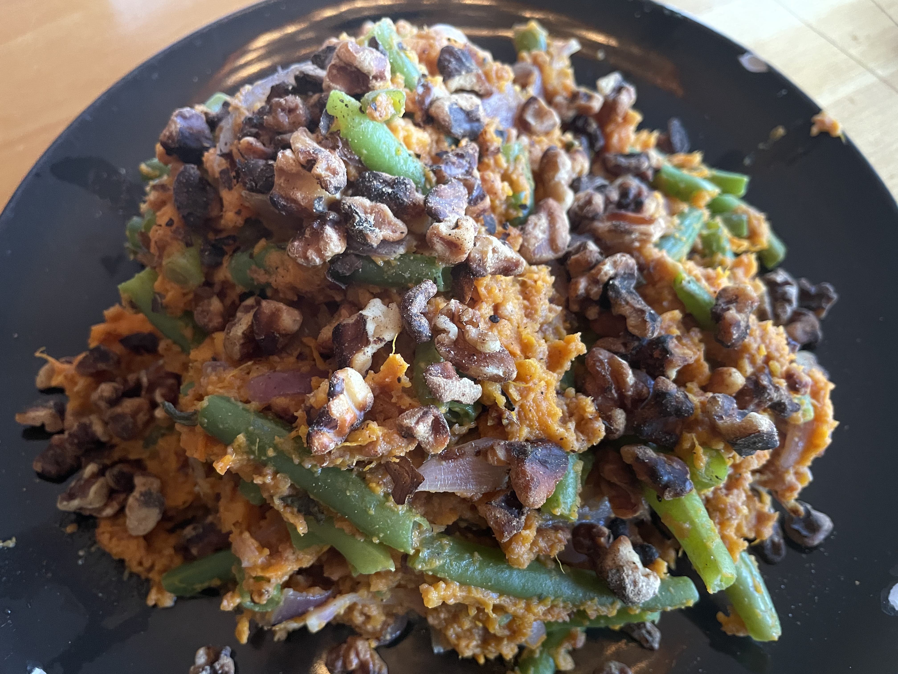

## Zoeteaardappel Sperziebonen Stamppot
## Sweet Potato Stringbean Stamppot
_Dutch_, _stamppot_, _Nederlandse keuken_, _28-dagen-stamppot_, _vegetarisch_, _vegetarian_  
Preparation time: 50-60 mins (roasting time 120 mins.)
3 portions

  

## Ingredients
* 900 g sweet potatoes (orange yams)
* XXX g string beans
* 2 medium red onions
* 3 cloves of garlic
* a splash of milk
* salt and pepper
* 100 g of crushed walnuts
* 1 tablespoon of rice vinegar
* 200 g cashew nuts
* 2 Tbsp olive oil

## Preparation
* Peel and cut sweet potatoes into quarters lengthwise and place onto a baking sheet. brush with olive oil and bake in oven at 375 C (190 C) for 2 hours.
* 
* Pour off the excess water form the potatoes and mash with a splash of milk, walnut oil and rice vinegar. Add salt and pepper to taste. 
* Mix the onion, garlic, brussels sprouts, mushrooms with the potatoe mash. 

### Eet Smakelijk!  

inspired by [de Hippe Vegetarier](https://www.dehippevegetarier.nl/vegetarische-recepten/zoete-aardappelstamppot-met-sperziebonen-en-salie/)

back to the [28-dag-stamppot calendar](https://mlopatka.github.io/recipe-book/)
