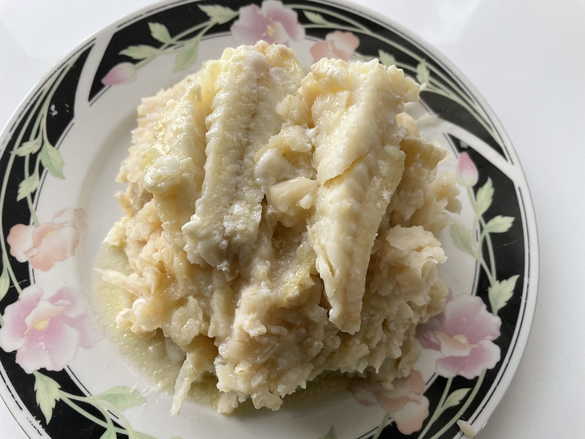

## 
## Sweet Potato Stringbean Stamppot
_Dutch_, _stamppot_, _Nederlandse keuken_, _28-dagen-stamppot_, _vegetarisch_, _vegetarian_  
Preparation time: 50-60 mins (roasting time 120 mins.)
3 portions

  

## Ingredients
* 1 kg sweet potatoes (orange yams)
* 300 g string beans
* 2 medium red onions
* 3 cloves of garlic
* a splash of milk
* salt and pepper
* 100 g of crushed walnuts
* 15 g fresh sage
* 300 g ground up vegetarian sausage
* 1/2 teaspoon nutmeg

## Preparation
* Peel and cut sweet potatoes into quarters lengthwise and place onto a baking sheet. Brush with olive oil and bake in oven at 375 C (190 C) for 2.5 hours.
* Wash and cut the string beans and boil them for 10-15 minutes until they are done.
* Finely cut sage. Leave a few leafs apart.
* Finely cut red onions and garlic. Fry with the ground up vegetarian sausage and sage for approximately 5 minutes. 
* Fry the sage leaves in a pan with a bit of olive oil.
* Roast the crushed walnuts in a pan without oil.
* Poor excess water of the string beans and sprinkle them with nutmeg.
* Mash the sweet potatoes with a splash of milk. Mix the string beans, and the onion mixture through the potato mash. Bring to taste with salt and pepper.
* Serve with the roasted walnuts and sage leaves.

### Eet Smakelijk!  

inspired by [de Hippe Vegetarier](https://www.dehippevegetarier.nl/vegetarische-recepten/zoete-aardappelstamppot-met-sperziebonen-en-salie/)

back to the [28-dag-stamppot calendar](https://mlopatka.github.io/recipe-book/)
