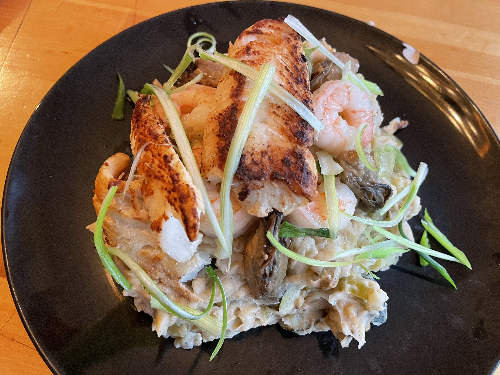

## Stoemp van de kust; Vlaamse zeevruchten stamppot
## Flemish-style seafood stamppot
_Belgian_, _stamppot_, _Vlaamse keuken_, _28-dagen-stamppot_, _seafood_, _zeevruchten_    
Preparation time: 60 mins  
2-3 portions

  

## Ingredients
* 500 g soft cooking potatoes (russet work just fine)
* 2 small courgettes (zucchini) look for dark green colouration
* 3 small roma tomatoes
* 2-3 cod fillets (Substitute for fresh locally available white fish ling or even trout will work and bring a nice variation to the overall flavour)
* 2 shallots
* 20 g butter
* 300 g mussels in shell (substitute for mussel or clam meat, if locally available)
* 100 g smoked oysters
* 300 g peeled prawns
* 1/2 lemon
* 100 ml white wine (Dry cooking wine is fine, but experiment wildly here, think about matching your choice of wine with the white fish used. Or you know, whatever you're drinking in the kitchen)
* 150 ml heavy creme
* 3-4 sprigs of green (spring) onion
* salt and pepper

## Preparation
* Squeeze the juice from one lemon and lie the cod fillets in lemon juice to denature.
* Peel and cut potatoes into 2-3 cm chunks and place in a large pot. Cover to the top with cold water and boil until soft (~20 minutes).
* Wash and cut the courgette into 1cm cubes. Dice the tomatoes into similar sized cubes and discard seeds and juice.
* If using shelled mussels, discard open shells and boil with white wine. If using processed mussel or clam meat, rinse and pat dry then sear in a deep pan at very high heat. Deglaze the pan with wine wine and set aside the seafood.
* In a separate deep pan, melt the butter and fry the finely sliced shallots.Combine in the courgette and tomato cubes and allow this to continue stewing on low heat for 15 minutes. Season this mixture with salt and pepper.
* Clean, devein, and remove tails from the prawns (or shrimp). Reusing the pan previously used for seafood sear the prawns on high heat for 5-6 minutes until heated throughout and a red colouration is achieved.
* Once again reusing this pan, briefly fry the fish fillets. If using thin fillets you can alternatively serve as a cheviche and skip the cooking.
* Drain the potatoes and allow excess moisture to evaporate for 2 minutes. Mash the potatoes with the heavy cream and (if using mussel/clam meat) and 1/2 of the prawns (reserve 1/2 he prawns for serving). Allow the seafood to get smashed up with the potatoes. 
* Stir the vegetable (shallot/tomato/courgette) mixture in with the potato/seafood portion.
* Assemble the stamppot with potato/seafood/vegetable mass on a large plate, top with remaining prawns and smoked oysters.
* Finely slice the spring onion into ribbons and serve atop the assembled stamppot.

### Eet Smakelijk!  

inspired by / adapted from [Lekker Tafelen](https://lekkertafelen.nl/recepten/hoofdgerecht/stamppot/stoemp-van-de-kust/)  

back to the [28-dag-stamppot calendar](https://mlopatka.github.io/recipe-book/)  
