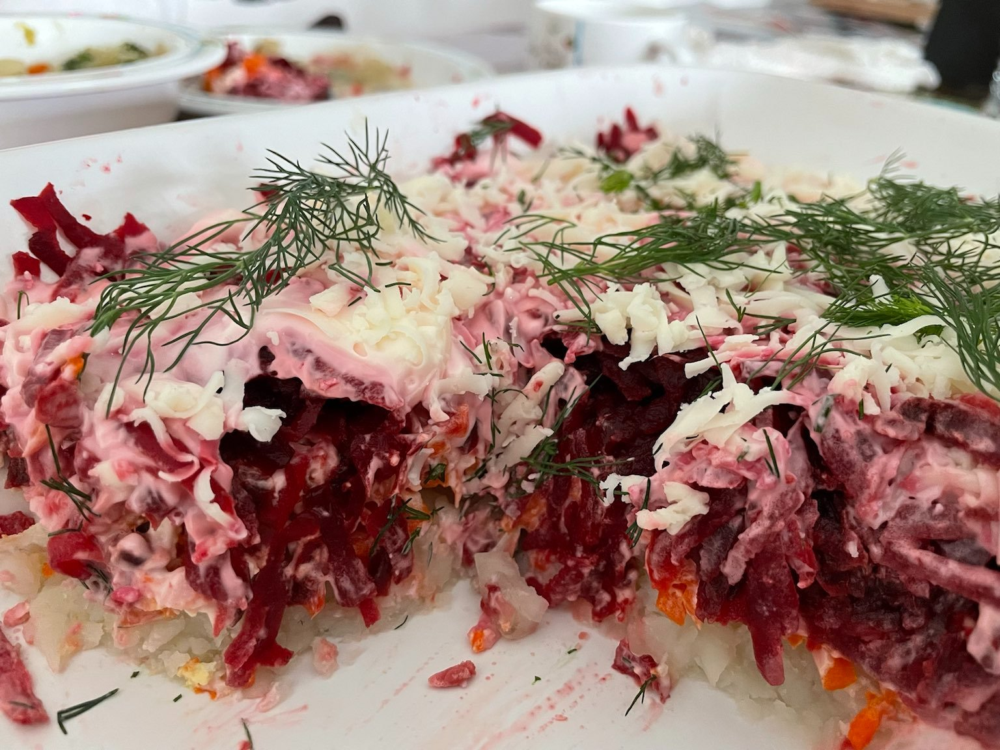

# Haring onder een bontjas  
# Sheldt pod shuboi  
## Herring under a fur coat  
_Russian_, _fish_  
Preparation time: 60 mins, and 6 hours in fridge
4-6 portions

  

## Ingredients
* 3 potatoes
* 1/2 onion
* 2 herrings (or a jar of pickled herring)
* 2 carrots
* 2 eggs 
* 3 red beets 
* lots of mayonaise 
* grated mild cheese (e.g., havarti cheese)
* lots of fresh dill

## Preparation
* Boil the beets for 45 - 60 mins. Peel them and let them cool completely.
* Peel potatoes and onions. Boil them until they are soft and let them cool completely (approx. 20 mins). This can be done the night before. 
* Boil the eggs for 10 mins. 
* Finely chop the half onion and the herring. 
* In a large oven dish, start layering. Start with (coarsely) grated potatoe, then the finely chopped onion. Continue with finely chopped herrings, topped by a layer of grated carrots.
* Then add a layer of grated eggs, mixed with some mayonaise. On top of the egg layer, add grated beets. Finish with a thick layer of mayonaise, topped by grated cheese. 
* Let the salad sit in the fridge for at least 6 hours. 
* Serve garnished with lots of dill. 

### Eet Smakelijk!

recipe inspired by / adapted from [Moms Dish](https://momsdish.com/recipe/132/shuba-fur-coat-salad) and [Peters Food Adventures](https://petersfoodadventures.com/2016/12/29/shuba-salad-herring-under-a-fur-coat/)
