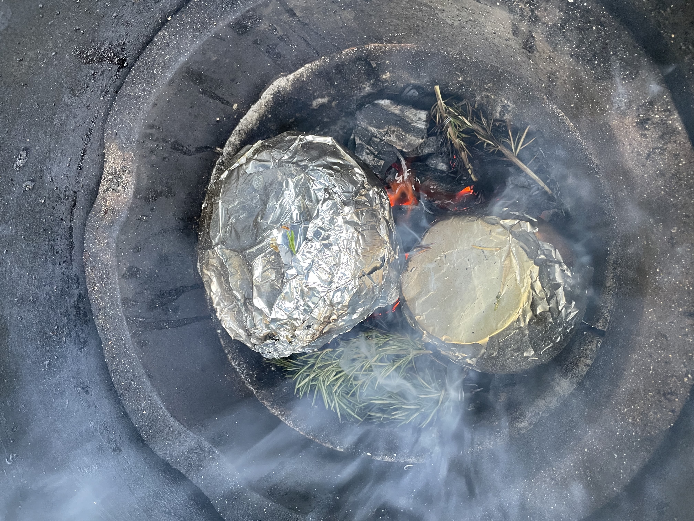
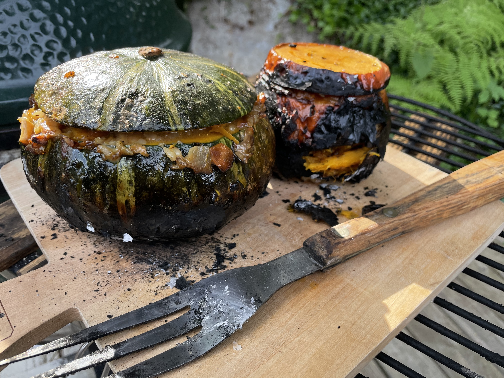

# Stuffed BBQ Pumpkins/Squashes
## gerookte gevulde pompoenen op de BBQ
_vegetarian_, _bbq_, _grill_, _squashes_, _canadian_, _charcoal_

Preparation time: 30 mins + 120 mins  

makes: 2-4 portions  

  
  

## Ingredients
* 2-4 small to medium sized pumpkins or squashes, (varietals in order of bestness: blue hubbard, kabocha, acorn, butternut, sugarpie)
* 1 medium yellow onion, coarsely chopped
* 8 large cloves of garlic, coarsely chopped
* 1 cube of vegetarian stock (boullion)
* 60g shitake, chantrelle (or other) dried mushrooms
* 6 large carrots (diced)
* paprika powder
* 150g cashew nuts
* 1.5 cups brown rice
* 4 Tbsp neutral oil (eg. grapeseed)
* salt and pepper
* 3 cups shredded high moisture, unripened, white cheese (this could be cheddar, havarti, mozzarella, pepperjack, or whatever you have on hand really)
* rosemary (an absurd amount) at least 6 large sprigs, but more is better.

## Preparation
* Prepare a low heat charcoal grill for 60-75 minute grilling time
* Cook the rice as usual, boil  and let it cool completely straining off any excess water. 
* Soak the rosemary sprigs in cold tapwater and set
* In a hot skillet or wok combine the oil, onion, garlic, diced carrots and stir until onions begin to get translucent.
* Add 2 cups of boiling water to dehydrated mushrooms and add the bouillon/stock cube to the hot water; set aside to rehydrate.
* Cut the tops off your squashes and scoop out the seeds and pulp, trip any excess innards and retain the tops.
* Add cashew nuts, paprika, salt and pepper to the skillet or wok.
* Add the mushrooms steeping in bouillon (including all fluid!) into the wok and reduce at low heat for 5-10 minutes.
* Stir in the cooked rice and combine with shredded cheese, turn off the heat to let the mixture cool down a bit.
* Scoop the filling into the pumpkins that you'll be cooking, they should be packed completely full.
* Cover the tops of the squashes with a bit of thick aluminum foil to help prevent spillage.
* Form a well in the smouldering charcoal and nestle the squashes right in among the coals; pack the area around the squashes with the soaked rosemary and restrict airflow for a low cool grilling temperature.
* Periodically check that the rosemary is producing smoke and continuously add soaked rosemary to the coals as it is consumed and rotate the squashes for even heat exposure. The outer skin should get completely charred while the inside cooks.
* Squashes are done when a grilling utensil (fork, skewer, stake) easily punctures the skin near the widest part of the squash. 

### Eet Smakelijk!